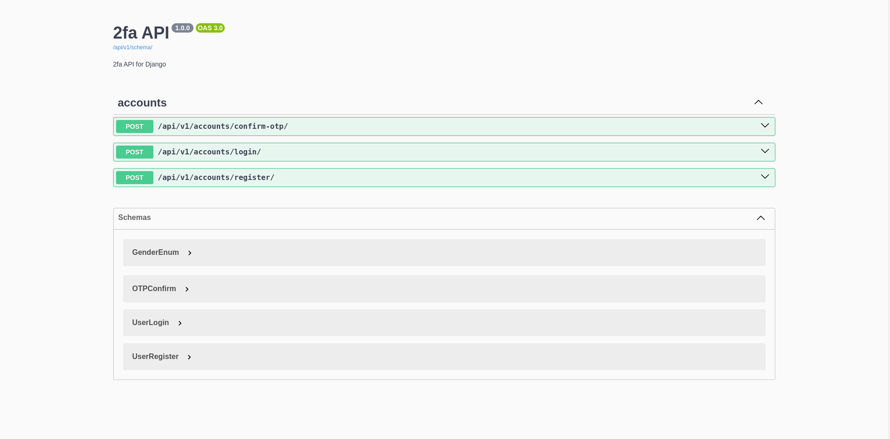
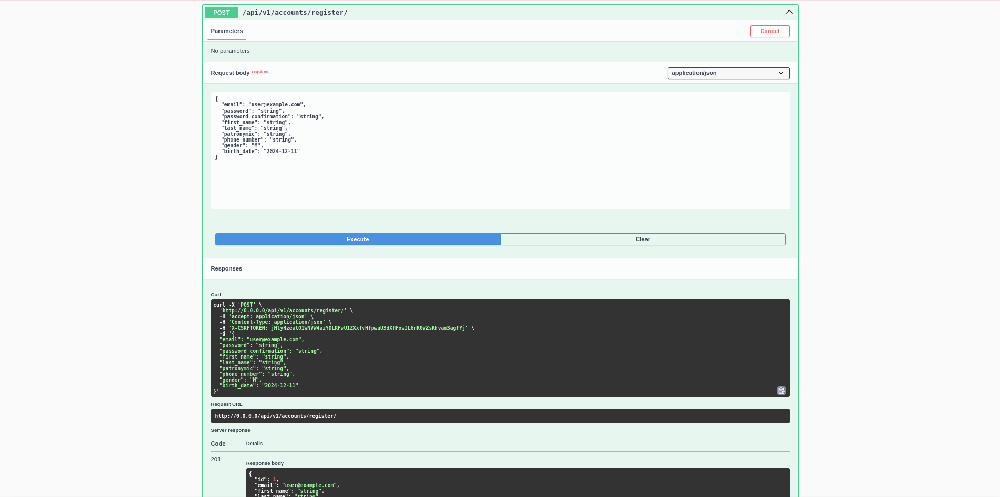
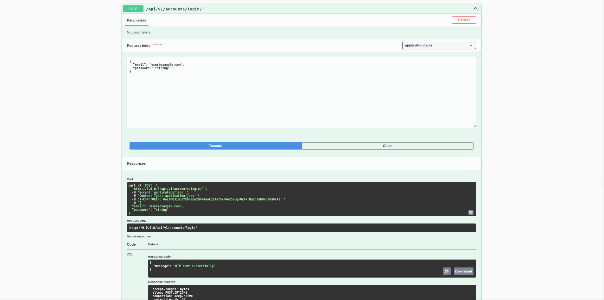
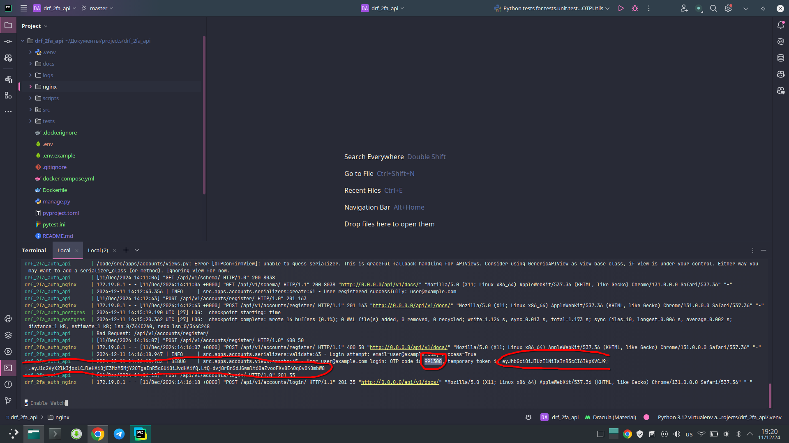
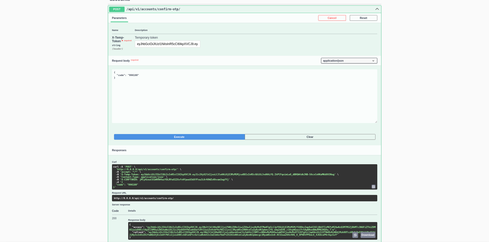

# Django rest framework two-factor authentication api

### Clone and setup
- Clone the repository
- copy the `.env.example` file to `.env` and update the values

## Installation without docker
- #### Requirements
  - Python 3.12+
  - Redis 6.0+
  - Postgres 13.0+

- #### Create a virtual environment
  - `python3 -m venv venv`
  - `source venv/bin/activate`
  - `pip install -r requirements.txt`

- #### Run the migrations
  - `python manage.py migrate`
  - `python manage.py runserver`

## Installation with docker
- #### Requirements
  - Docker 27.3+
  - Docker-compose 2.31+
- #### Run `docker-compose up --build`

### Usage
- #### Navigate to `http://0.0.0.0/api/v1/docs` to access the api

- #### Register user

- #### Login user

- #### Get opt and tmp token from logs

> [!WARNING]
> Do not use this in production, this is just for testing purposes

- #### Verify otp
